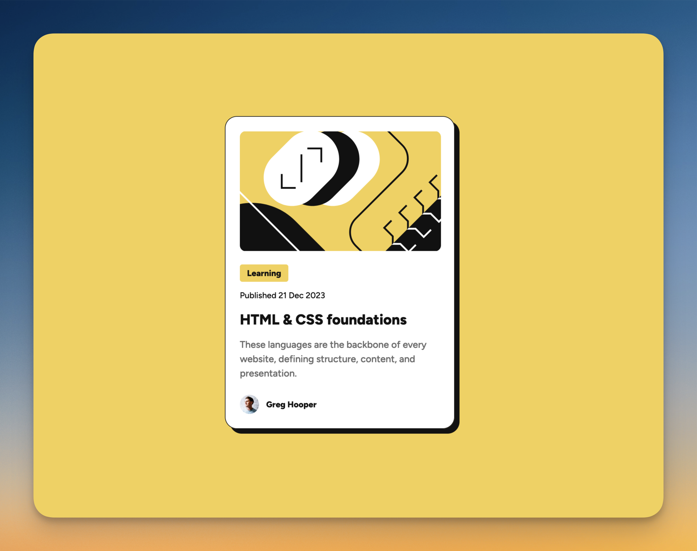

# Frontend Mentor - Blog preview card solution

This is a solution to the [Blog preview card challenge on Frontend Mentor](https://www.frontendmentor.io/challenges/blog-preview-card-ckPaj01IcS). Frontend Mentor challenges help you improve your coding skills by building realistic projects. 

## Table of contents

- [Overview](#overview)
  - [The challenge](#the-challenge)
  - [Screenshot](#screenshot)
  - [Links](#links)
- [My process](#my-process)
  - [What I learned](#what-i-learned)
  - [Continued development](#continued-development)
- [Author](#author)

## Overview

### The challenge

Users should be able to:

- See hover and focus states for all interactive elements on the page

### Screenshot



### Links

- Solution URL: [Add solution URL here](https://your-solution-url.com)
- Live Site URL: [Add live site URL here](https://your-live-site-url.com)

## My process

### What I learned

This snippet needs to be memorized since it's used commonly. 2 stylesheet link from the html file. The one we are creating, and the one for any special font we're using. 
```html
 <link rel="stylesheet" href="style.css">
 <link rel="stylesheet" href="https://fonts.google.com/specimen/Figtree">
```
Other almost boilerplate code snippet for the CSS stylesheet that needs to be added almost by default

```css
*{
    margin: 0;
    padding: 0;
    box-sizing: border-box;
}
```

Using a red box around every element was also very helpful to see how every change was changing the layout and dimensions of the boxes. 

Centering cards in the middle of the page:
```css
main {
    display: flex;
    justify-content: center;
    align-items: center;
    flex-direction: column;
    height: 100vh;
}
```

- Hsl notation: hsl(xx xx xx) *without commas...*


- Hover
  - You can add all the changes that happened when an element is hovered over and any other elements that are affected when that happens in the same declaration which is nice. 
  - When hovering over and adding additional transitions, you want to add the ease-ins and all of the fancy stuff to the element in the non-hover declaration. It seems like the system triggers the change and since it's only on hover status, when, it's not on hover and moving into that state, the element triggers the animation. Need to check in more detail why it happens that way.

- Look at the figma file and measure things before start coding

### Continued development

- Need to practice more on margins. These margins in figma look 24px for the content around the card content but in reality, matching the browser to the picture, it looks different. Not sure why. 
- Need to keep practicing the flex boxes layout

**Note: Delete this note and the content within this section and replace with your own plans for continued development.**


## Author

- Frontend Mentor - [@newspaceracer](https://www.frontendmentor.io/profile/newspaceracer)
- LinkedIn - [Mauricio Herrera](https://www.linkedin.com/in/mauricio-herrer4/)
